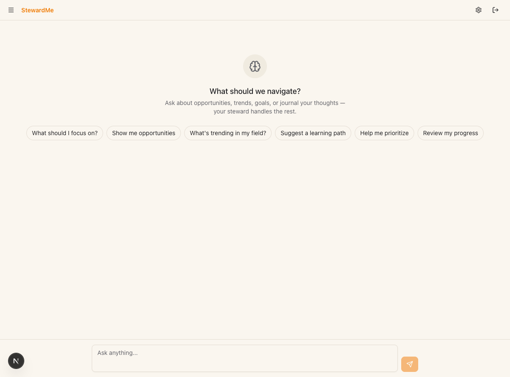
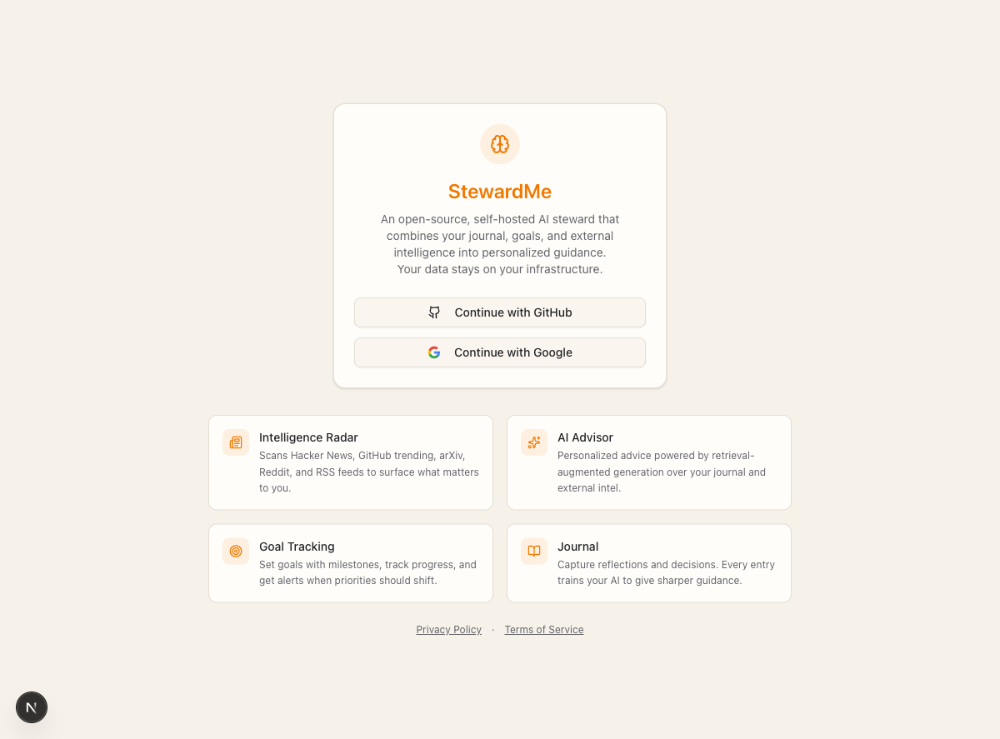

# StewardMe

[](https://github.com/contractorr/stewardme/actions/workflows/test.yml)
[](https://github.com/contractorr/stewardme/actions/workflows/lint.yml)
[](https://www.python.org/downloads/)
[](LICENSE)
[](CONTRIBUTING.md)

**An open-source AI steward that monitors the world and tells you what to do next.**

Your journal, goals, and 10 live intel sources feed a RAG pipeline that delivers personalized, explainable guidance — entirely self-hosted.

- **Scans the world for you** — HN, GitHub, arXiv, Reddit, Product Hunt, YC Jobs, Google Patents, RSS, and more
- **Learns from your behaviour** — feedback loop adjusts recommendations, reasoning traces explain every suggestion
- **Runs anywhere you want** — CLI, web app, MCP server for Claude Code, or Docker one-liner



## Why StewardMe?

| | ChatGPT / Copilot | Notion AI | StewardMe |
|---|---|---|---|
| **Your data stays local** | No | No | Yes — SQLite + markdown files |
| **Scans live sources for you** | No | No | Yes — 10 async scrapers (HN, arXiv, GitHub, Reddit, RSS, ...) |
| **Learns from your feedback** | No | No | Yes — per-category scoring adjusts over time |
| **Self-hosted** | No | No | Yes — Docker one-liner or bare metal |
| **Multi-provider LLM** | GPT only | GPT only | Claude, OpenAI, Gemini (auto-detect) |
| **Open source** | No | No | AGPL-3.0 |

## What it does

- **Journal + semantic search** — markdown entries with YAML frontmatter, embedded in ChromaDB, quick capture from the dashboard
- **Intelligence radar** — 10 async scrapers, SQLite storage with URL + content-hash dedup, no API keys needed
- **AI advisor** — RAG retrieval (dynamic journal/intel blend from engagement data) fed to Claude, OpenAI, or Gemini
- **Goal tracking** — milestones, check-ins, staleness detection
- **Proactive recommendations** — learning, career, entrepreneurial, investment opportunities with structured reasoning traces
- **Behavioural learning** — feedback buttons on every recommendation, per-category scoring adjusts over time
- **Deep research** — topic selection from your context, web search, LLM synthesis
- **Trend detection** — KMeans clustering on journal embeddings to surface emerging/declining topics
- **Agentic coaching** — signal detection, burnout alerts, deadline warnings, autonomous actions
- **Rich onboarding** — first-run wizard with LLM connectivity test, conversational profile interview

Works as a CLI (`coach`), web app (FastAPI + Next.js), or MCP server for Claude Code.

## Quick start

### Prerequisites

- Python 3.11+
- Node.js 18+ (for web UI)
- An LLM API key (Claude, OpenAI, or Gemini)

### Install

```bash
git clone https://github.com/contractorr/stewardme.git
cd stewardme
python -m venv .venv && source .venv/bin/activate
pip install -e ".[all-providers]"
coach init
```

### Configure

```bash
cp config.example.yaml ~/coach/config.yaml
# Edit with your preferences — API key can be set via env var or in-app
export ANTHROPIC_API_KEY="your-key"
```

### Run the CLI

```bash
coach journal add "Starting my Rust learning journey"
coach ask "What should I focus on this week?"
coach goals add "Learn Rust" --deadline 2025-06-01
coach scrape        # gather intel from all sources
coach trends        # detect emerging topics
coach research run "distributed systems"
```

### Run the web app

```bash
# Backend
pip install -e ".[web]"
cp .env.example .env  # fill in SECRET_KEY, NEXTAUTH_SECRET, OAuth creds
uvicorn src.web.app:app --reload --port 8000

# Frontend (separate terminal)
cd web && npm install && npm run dev
```

Open http://localhost:3000 — sign in with GitHub or Google.

### Docker (fastest)

```bash
cp .env.example .env  # fill in SECRET_KEY, NEXTAUTH_SECRET, OAuth creds
docker compose up --build
```

See [SETUP.md](SETUP.md) for full instructions including secret generation and production deployment.

## Architecture

```
src/
├── journal/        # Markdown storage, ChromaDB embeddings, semantic search, trends
├── advisor/        # LLM orchestration, RAG retrieval, recommendations, goals
├── intelligence/   # 10 async scrapers, SQLite storage, APScheduler
├── research/       # Deep research agent, topic selection, web search, synthesis
├── llm/            # Provider factory — Claude, OpenAI, Gemini (auto-detect from env)
├── profile/        # User profile management
├── coach_mcp/      # MCP server (22 tools for Claude Code integration)
├── web/            # FastAPI backend — auth, encrypted key storage, REST API
├── cli/            # Click CLI, Pydantic config, structlog, retry, rate limiting
web/                # Next.js frontend — OAuth, chat-first UI, dashboard
```

**Data flow:**

1. Journal entries → markdown files + ChromaDB embeddings + sentiment analysis
2. Scrapers → SQLite with URL + content-hash dedup
3. Query → RAG retrieval (journal + intel) → LLM → personalized advice
4. Goals + journal → topic selection → deep research → reports
5. Embeddings → KMeans clustering → trend detection

## Screenshots

| Dashboard | Onboarding |
|-----------|------------|
|  |  |

## Configuration

See [`config.example.yaml`](config.example.yaml) for all options. Key sections:

| Section | What it controls |
|---------|-----------------|
| `llm` | Provider, API key, model override |
| `paths` | Journal dir, ChromaDB dir, intel DB |
| `sources` | RSS feeds, GitHub languages, Reddit subs, arXiv categories |
| `rag` | Context budget, journal/intel weight split |
| `recommendations` | Categories, dedup threshold, schedule |
| `research` | Web search provider (Tavily or DuckDuckGo free), schedule |
| `rate_limits` | Per-source token bucket config |
| `schedule` | Cron for intel gathering, reviews, research |

Config locations (checked in order): `./config.yaml` → `~/.coach/config.yaml` → `~/coach/config.yaml`

## CLI commands

| Command | Description |
|---------|-------------|
| `coach journal add/list/search/view/sync` | Journal CRUD + semantic search |
| `coach ask "question"` | Ask advisor with RAG context |
| `coach review` | Weekly review of recent entries |
| `coach goals add/list/check-in/status/analyze` | Goal tracking + milestones |
| `coach recommend [category]` | Generate recommendations |
| `coach research run/topics/list/view` | Deep research |
| `coach scrape` | Run all intel scrapers |
| `coach trends` | Detect emerging/declining topics |
| `coach mood` | Mood timeline from journal sentiment |
| `coach reflect` | Get reflection prompts |
| `coach daemon start` | Background scheduler |

## Web UI routes

| Route | Description |
|-------|-------------|
| `/` | Chat-first interface with daily briefing |
| `/journal` | Create, read, delete entries |
| `/goals` | Goals + milestones + check-ins |
| `/intel` | Intelligence feed |
| `/trends` | Topic trend visualization |
| `/settings` | API key management (Fernet-encrypted) |

## MCP server

StewardMe exposes 22 tools via MCP for Claude Code integration. No LLM calls in the MCP layer — Claude Code does the reasoning, MCP provides data.

```bash
python -m coach_mcp  # stdio transport
```

Configured in `.mcp.json` for auto-discovery.

## Development

```bash
pip install -e ".[dev]"

# Tests
ANTHROPIC_API_KEY=test-key pytest              # all tests
pytest tests/web/ -v                           # web API only
pytest --cov=src --cov-report=term-missing     # with coverage

# Lint + format
ruff check src tests
ruff format src tests

# Type check
mypy src/ --ignore-missing-imports
```

See [CONTRIBUTING.md](CONTRIBUTING.md) for contribution guidelines.

## Adding a new intelligence source

1. Create scraper in `src/intelligence/sources/` inheriting `BaseScraper`
2. Implement `source_name` property + `scrape()` async method
3. Register in `scheduler.py` → `_init_scrapers()`

## Deployment

Production setup uses Caddy as reverse proxy with auto HTTPS:

```bash
./deploy.sh  # validates .env, builds, starts docker compose prod
```

See `docker-compose.prod.yml` and `Caddyfile` for details.

## Troubleshooting

| Issue | Fix |
|-------|-----|
| `RateLimitError` from LLM | Reduce `rate_limits` in config; retries handle transient 429s |
| ChromaDB schema errors | Delete `~/coach/chroma/` and run `coach journal sync` |
| Stale embeddings | Run `coach journal sync` after manual file edits |
| Daemon not logging | Check `~/coach/logs/`; daemon uses JSON structlog |

## License

[AGPL-3.0](LICENSE) — free to use and self-host. If you run a modified version as a service, you must open-source your changes.
