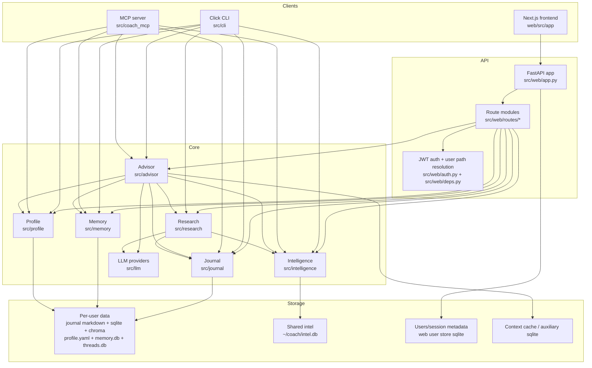
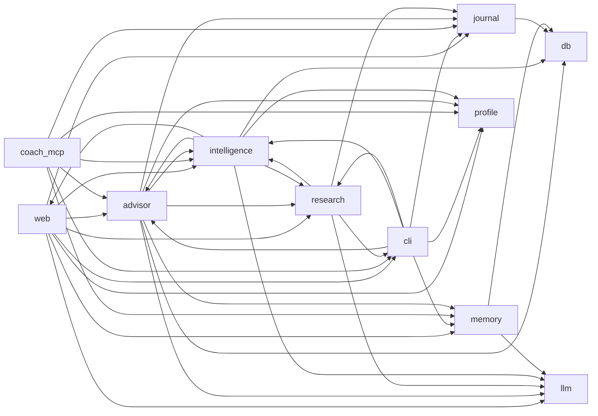

# Architecture

## Overview

StewardMe is a multi-surface AI assistant with three Python entrypoints and one separate web frontend:

- `coach` CLI for local workflows and operations
- FastAPI backend for authenticated multi-user web access
- MCP server for tool-based access from external agent clients
- Next.js frontend in `web/` for the browser UI

All four surfaces converge on the same domain modules in `src/`: `advisor`, `intelligence`, `journal`, `memory`, `profile`, `research`, and `llm`. Persistence is intentionally split between per-user stores (`~/coach/users/{user_id}/...`) and a shared world-intel store (`~/coach/intel.db`).

---

## Architecture Diagram

---

## Module Responsibilities

| Module | Primary responsibility | Key entry files | Main dependencies |
|---|---|---|---|
| `web` | Multi-user API layer, auth, route wiring, request-scoped path resolution, and web-specific persistence | `src/web/app.py`, `src/web/routes/*`, `src/web/deps.py` | `services`, `advisor`, `journal`, `intelligence`, `research`, `memory`, `profile`, storage helpers, neutral config/user-state helpers |
| `advisor` | Main orchestration layer for ask/brief/recommendation flows, RAG assembly, prompts, scoring, action briefs, agentic behaviors | `src/advisor/engine.py`, `src/advisor/rag.py`, `src/advisor/recommendations.py` | `llm`, `journal`, `intelligence`, `profile`, `memory`, `research` |
| `intelligence` | External world-intel ingestion, dedup, storage, scheduling, source adapters, trending radar, watchlists | `src/intelligence/scraper.py`, `src/intelligence/scheduler.py`, `src/intelligence/sources/*` | `db`, `research`, `llm`, neutral retry/config/user-state helpers |
| `research` | Topic selection, web search, synthesis, dossier generation, and long-form research workflows | `src/research/agent.py`, `src/research/web_search.py`, `src/research/synthesis.py` | `llm`, `intelligence`, `journal`, neutral retry/rate-limit helpers |
| `journal` | Personal journaling storage, embeddings sync, semantic search, FTS, trends, threads, export | `src/journal/storage.py`, `src/journal/search.py`, `src/journal/thread_store.py` | `db` |
| `memory` | Fact extraction, conflict resolution, persistent user memory, retrieval for advisor | `src/memory/store.py`, `src/memory/pipeline.py`, `src/memory/extractor.py` | `db`, `llm` |
| `profile` | Structured user profile model, onboarding/interview flow, profile persistence and summaries | `src/profile/storage.py`, `src/profile/interview.py` | mostly self-contained |
| `llm` | Provider abstraction and adapters for Claude, OpenAI, Gemini | `src/llm/factory.py`, `src/llm/base.py`, `src/llm/providers/*` | provider SDKs |
| `cli` | Local operator surface, config loading, logging, command registration, and daemon/admin flows | `src/cli/main.py`, `src/cli/commands/*`, `src/cli/config.py` | `services`, domain modules, neutral config/storage helpers |
| `coach_mcp` | MCP tool server exposing journal/intel/advisor/profile actions to external agent clients | `src/coach_mcp/server.py`, `src/coach_mcp/tools/*` | `services`, `advisor`, `journal`, `intelligence`, `memory`, `profile`, storage/bootstrap helpers |
| `web/` frontend | Browser UI, authentication, dashboard pages, API client, session handling | `web/src/app/*`, `web/src/lib/api.ts`, `web/src/lib/auth.ts` | FastAPI backend + NextAuth |
| `db.py` and shared utilities | Shared SQLite connection policy and low-level helpers | `src/db.py`, `src/chroma_utils.py`, `src/shared_types.py`, `src/observability.py` | foundational |

---

## Dependency Graph

### Logical package graph

### Observed dependency shape

- `journal`, `memory`, and `profile` are the cleanest domain modules.
- `advisor` is the system hub; nearly every surface or workflow eventually flows through it.
- `web` and `cli` are not thin shells yet; both import deeply into domain modules.
- `intelligence`, `research`, `advisor`, `web`, and `cli` form the densest dependency cluster.

### Notable package-level cycles

- `advisor` ? `intelligence`
- `advisor` ? `web`
- `cli` ? `research`
- `cli` ? `intelligence`
- `intelligence` ? `web`

These cycles do not prevent the app from working, but they increase the risk of import-order surprises, harder test setup, and blurred ownership boundaries.

---

## Potential Weak Points

### 1. Dense cross-package coupling around orchestration

The repository has a strong center of gravity around `advisor`, `web`, `intelligence`, `research`, and `cli`. That makes feature delivery fast, but it also means changes in one orchestration path can ripple across multiple surfaces.

**Risk:** harder refactors, more mocking in tests, and higher chance of accidental regressions.

### 2. Composition roots still own operational behavior

`src/web/app.py`, `src/cli/main.py`, and `src/coach_mcp/server.py` are much thinner than before, but they still own some startup wiring and composition concerns.

**Risk:** operational behavior is better isolated now, but entrypoint changes can still have broader effects than ordinary feature modules.

### 3. Persistence model is powerful but fragmented

The system uses markdown files, multiple SQLite databases, Chroma embeddings, per-user directories, and a shared intel DB.

**Risk:** migrations, backup/restore, and cross-store consistency are easy to get wrong. Bugs often appear as path-resolution or “wrong store” issues rather than obvious logic failures.

Document upload deepens this risk because a single user action can now touch binary file storage, metadata records, extracted-text indexes, conversation attachments, and memory facts.

### 4. Shared-vs-user-scoped storage is a recurring correctness boundary

The architecture intentionally mixes global intel with per-user journal/profile/memory data.

**Risk:** web routes and helper functions must choose the correct store every time. Any accidental use of shared storage for personal data becomes a multi-user isolation bug.

### 5. Surface duplication can drift over time

CLI commands, web routes, and MCP tools expose overlapping capabilities, but they are implemented in different wrappers.

**Risk:** validation, serialization, and error handling can diverge between surfaces even when the underlying business logic is the same.

### 6. Optional-provider and external-source fanout increases failure modes

The app supports multiple LLM providers and many intel sources with different schemas, reliability profiles, and rate limits.

**Risk:** behavior is robust overall, but edge cases cluster around retries, partial failures, throttling, and normalization of heterogeneous upstream data.

---

## Architectural Guardrails

These are the ongoing rules that still matter after the refactor work is complete.

### Dependency Direction

- Surface packages (`web`, `cli`, `coach_mcp`) may depend on `services`, domain modules, storage helpers, and neutral infrastructure helpers.
- Domain and orchestration packages (`advisor`, `intelligence`, `research`, `services`) should not depend directly on `web` or `cli` packages.
- Shared infrastructure helpers should live in neutral modules such as `src/coach_config.py`, `src/retry_utils.py`, `src/rate_limit.py`, `src/crypto_utils.py`, and `src/user_state_store.py`.

### Storage Rules

- Storage scope decisions should be centralized in `src/storage_paths.py` and `src/storage_access.py`.
- Shared/global stores must be explicit, with `intel_db` as the primary example.
- User-scoped stores should always resolve through canonical per-user path helpers.
- SQLite-backed stores should set or preserve an explicit schema/version marker during initialization.
- File-backed stores should create a lightweight metadata marker when schema discovery would otherwise be implicit.
- Binary user uploads and their extracted text/search indexes must remain user-scoped and must never be persisted inside shared/global databases.

### Surface Rules

- Keep auth, request parsing, and output formatting in the surface layer.
- Put reusable orchestration in `src/services/` or an existing domain module.
- Use shared path/store helpers instead of constructing storage inline.
- Composition roots should register routers, commands, and tools through shared registries instead of hand-wiring large module lists.

### Verification

- `tests/test_architecture_boundaries.py` enforces the main package-boundary rules.
- `tests/cli/test_registry.py` and `tests/coach_mcp/test_registry.py` verify the composition-root registries.
- `tests/test_store_lifecycle.py` verifies the store versioning and lifecycle markers.

